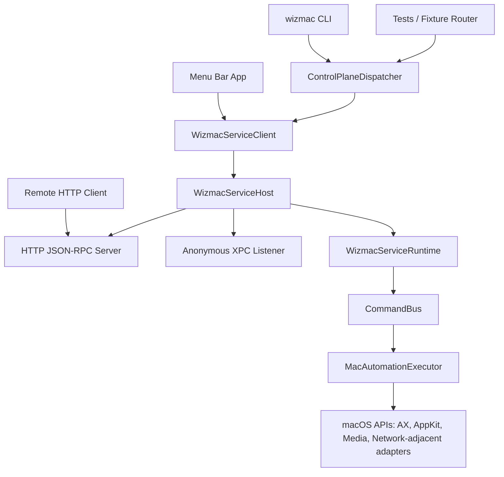
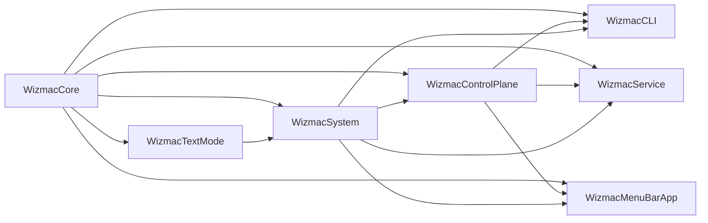

# Wizmac Architecture

This document explains how Wizmac is put together, why the shared-service model exists, and which components own which responsibilities.

## Design Goals

Wizmac is designed around a few core goals:

- expose one coherent automation surface for humans and agents
- keep macOS-specific automation inside a small set of executor/adaptor layers
- preserve auditability and approval gates for risky actions
- support both local and paired remote callers without duplicating runtime state
- keep stateful sessions, like UI search or text mode, inside one long-lived shared service

## Non-Goals

Wizmac is not trying to be:

- a cross-platform automation framework
- a purely stateless tool runner
- a browser-based remote-control service
- a fully complete libvim embedding yet

## Component Overview

## Package Dependency Graph

## Runtime Topology

The most important runtime boundary is between clients and the shared service:

- `WizmacCLI` creates a `ControlPlaneDispatcher`, but by default that dispatcher routes into `ServiceClientControlPlaneRouter`, not a private in-process executor.
- `WizmacServiceClient` uses `WizmacServiceProcessManager` to auto-start the long-lived `WizmacService` if it is not already running.
- `WizmacServiceHost` publishes a localhost HTTP server on port `7877`, an anonymous XPC listener, and optionally a remote HTTP server using the configured remote settings.
- `WizmacServiceRuntime` owns session state, approval queues, settings snapshots, audit data, remote identities, and remote server health.

This means stateful features stay coherent across callers:

- UI session caches
- hint sessions
- scroll sessions
- text attachments and modes
- trusted automation sessions
- approval queues
- paired remote identities

## Request Lifecycle

### 1. Surface request formation

A caller enters through one of these surfaces:

- namespaced CLI syntax like `wizmac ui search --query Primary`
- explicit tool syntax like `wizmac call ui.search query=Primary`
- JSON-RPC on CLI, MCP stdio, or HTTP
- menu bar backend calls through `WizmacServiceClient`

The public tool inventory lives in `ControlPlaneToolRegistry`.

### 2. Control-plane normalization

`ControlPlaneDispatcher` translates tool calls into `ControlPlaneActionRequest`, handles JSON-RPC methods like `tools/list` and `resources/read`, and can auto-start a trusted local automation session when:

- the request is local (`cli`, `mcp`, or `menuBar`)
- the action is allowed by `TrustedAutomationPolicy.defaultAllowedActions`
- either `autoTrust=true` is set explicitly, or the request is already scoped to a specific app, PID, or window

### 3. Service routing

Once the request reaches the shared service:

- service-owned actions are handled directly in `WizmacServiceRuntime`
- executor-owned actions flow through `CommandBus`

Service-owned actions currently include:

- service health and session inspection
- trusted-session start and end
- remote client list, pair, and revoke
- window exclusion persistence

Executor-owned actions include:

- UI search, capture, click, copy, drag, and execute batches
- scroll discovery and step actions
- window listing and focus
- text mode attach, detach, insert, send keys, mode, and status
- Music and AirPlay actions
- permission and audit inspection

## Approval And Audit Model

Wizmac uses an explicit approval queue rather than silently executing all state-changing actions.

### Approval pipeline

1. `ApprovalPolicy` decides whether the request needs confirmation.
2. Risky requests are written to `ApprovalStore`.
3. The caller receives a `confirmationRequired` response with an approval ID.
4. A human or trusted caller resolves the approval through `system.confirmation_status` or `system.confirmation_resolve`.
5. `CommandBus` or `WizmacServiceRuntime` finalizes the request and appends audit entries.

### Important defaults

- Menu bar, hotkey, and test origins bypass approval.
- Default risky actions include click, copy, drag, focus, text mutation, AirPlay changes, Music volume changes, remote pairing, and remote revocation.
- Default auto-approved actions include search, capture-like reads, permissions, health, sessions, and trusted-session start/end.

## Trusted Automation Sessions

Trusted automation is a short-lived local safety escape hatch, not a blanket bypass.

The active session is scoped by:

- app identity and optional PID
- expiration time
- allowed actions
- local origins only

Requests are allowed only when:

- the request carries the matching `trustedSessionID` or source session ID
- the action is on the allowed-action list
- the app or PID still matches the active session constraints

## Remote Access Model

Remote access is intentionally separate from local trust.

### Pairing

`remote.pair` creates:

- a new client ID
- a P256 signing keypair
- a certificate-like PEM payload
- a CA-like authority record
- remote enrollment material returned to the caller

### Authentication

For authenticated remote HTTP requests:

- the caller must send `X-Client-ID`
- the server looks up that client in `RemoteIdentityStore`
- signature auth is preferred through `X-Wizmac-Signature`
- a legacy bearer-token migration path still exists for old clients

Important current caveat:

- if remote HTTP is enabled before any identities are paired, the current listener does not enforce remote auth yet and should be treated as local-development-only

### Anti-spoofing rule

When remote auth is enabled, HTTP requests are always treated as remote origins. Embedded JSON-RPC `source` payloads do not get to impersonate local callers.

## Persistence Model

Wizmac stores durable state in `~/Library/Application Support/Wizmac/`.

Core files:

- `settings.json`: settings, interfaces, hotkeys, remote server settings, risky-action defaults
- `audit.jsonl`: append-only audit trail
- `pending-approvals.json`: current approval queue
- `service-state.json`: persisted health snapshot
- `remote-identities.json`: current paired remote identities and authority metadata
- `remote-client-secrets.json`: legacy bearer-token records
- `service-endpoint.xpc`: local transport descriptor for service discovery
- `Certificates/`: certificate material directory referenced by remote settings

## Session Model

The service snapshot exposes a normalized view of active state:

- `uiSession`
- `hintSession`
- `scrollSession`
- `textSession`
- `trustedAutomationSession`
- `activeSessions` as summarized `ServiceSessionRecord` values

This gives the menu bar app and diagnostic tools a stable read model even though the underlying features are implemented by different subsystems.

## Why The Fixture App Matters

`WizmacFixtureHost` is part of the architecture, not an afterthought.

It gives contributors a deterministic UI surface with:

- multiple windows
- searchable buttons and hierarchy entries
- tables and list selection
- modal surfaces like alerts, sheets, and popovers
- AppKit text controls
- a WebKit editable surface

That helps keep automation and text-mode changes testable without depending on arbitrary third-party apps.

## Extension Boundaries

When extending the system, keep these seams stable:

- `ActionName` is the contract between public tools and executor/runtime behavior.
- `ControlPlaneToolRegistry` is the discoverable tool inventory.
- `ControlPlaneDispatcher` is the normalization layer for all front doors.
- `WizmacServiceRuntime` owns service-specific state and remote identity lifecycle.
- `CommandBus` owns approval and audit composition around execution.
- `MacAutomationExecutor` is the macOS edge and should not absorb service-only responsibilities.

## Current Limitations

- The text engine is wired through `LibVimTextModeEngine`, but the current implementation still uses an embedded reducer-backed shim.
- The remote transport is a lightweight HTTP parser/server rather than a full production web stack.
- The codebase currently targets macOS only.
- Some remote-auth comments in older docs or code may still mention bearer tokens, but the preferred path is signature-based pairing.
- Some service-health surfaces still describe the local control plane as `xpc://wizmac/service`, while actual local client discovery currently resolves to `http://127.0.0.1:7877/rpc`.

For the change-oriented version of this document, continue with [implementation-guide.md](implementation-guide.md).
